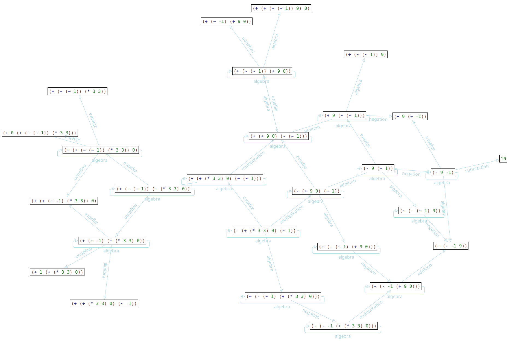

# redex-cas

A work-in-progress computer algerba system written in PLT Redex.

Below, a a diagram showing all the possible transformations the expr 
`((3 * 3) + 0) - (- 1)`, represented in the CAS' syntax as
`(-(+ (* 3 3) 0) (~ 1)))`, can undergo before becoming `10`.

